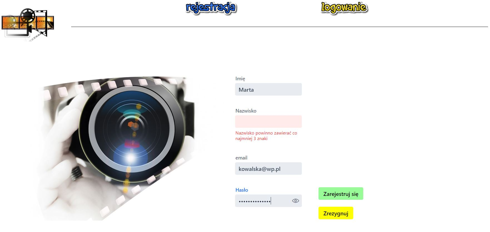
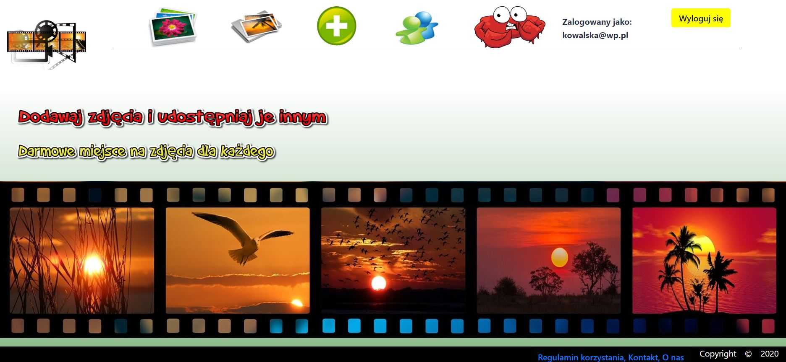
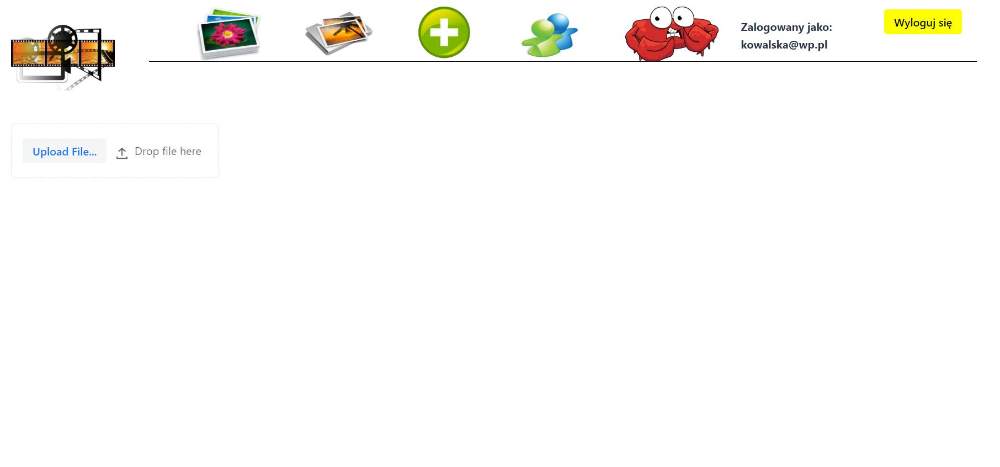
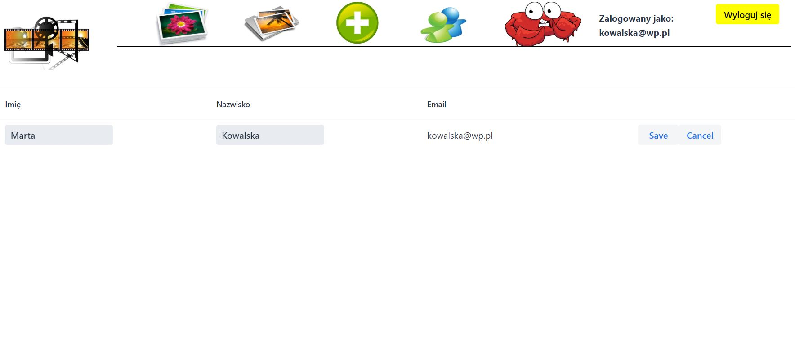

# app-with-photo-album

## Table of contents
* [General info](#general-info)
* [Technologies](#technologies)
* [Screenshots](#screenshots)
* [Installation](#installation)
* [Status](#status)


<div align="center">
      <a href="https://youtu.be/embed//wIpZpRC93cg">
     
      </a>
    </div>


## General info

This app allows:
- new user registrations
- logging in to an account with user or admin access
- upload photos with descriptions to your own account
- browsing photos of other users
- editing data
- browsing user list and deleting user account from admin level
- logging out


## Technologies
* [Spring Boot] - version 2.1.6
* [Vaadin] - version 14.0.1

## Screenshots

### Register Page



### User Page



### Add new photo



### Edit Profile



## Installation
This app is a Spring Boot application built using Maven. You can build a jar file and run it from the command line:

git clone https://github.com/martadrabik-dabrowska/app-with-photo-album
```sh
cd app-with-photo-album
./mvnw package
java -jar target/*.jar
```

You can then access app here: http://localhost:8096/

## Status
Project is: _in progress_

License
----

MIT

Photos from [Pixabay]


[Spring Boot]: <https://spring.io/projects/spring-boot>
[Vaadin]: <https://vaadin.com/releases>
[Pixabay]: <https://pixabay.com/pl/>

